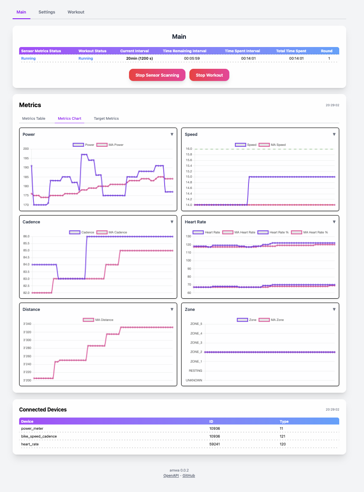
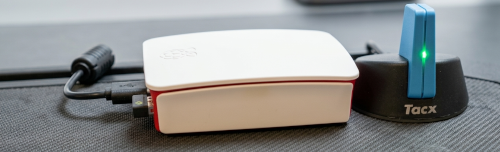
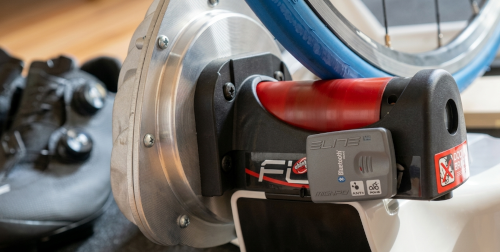
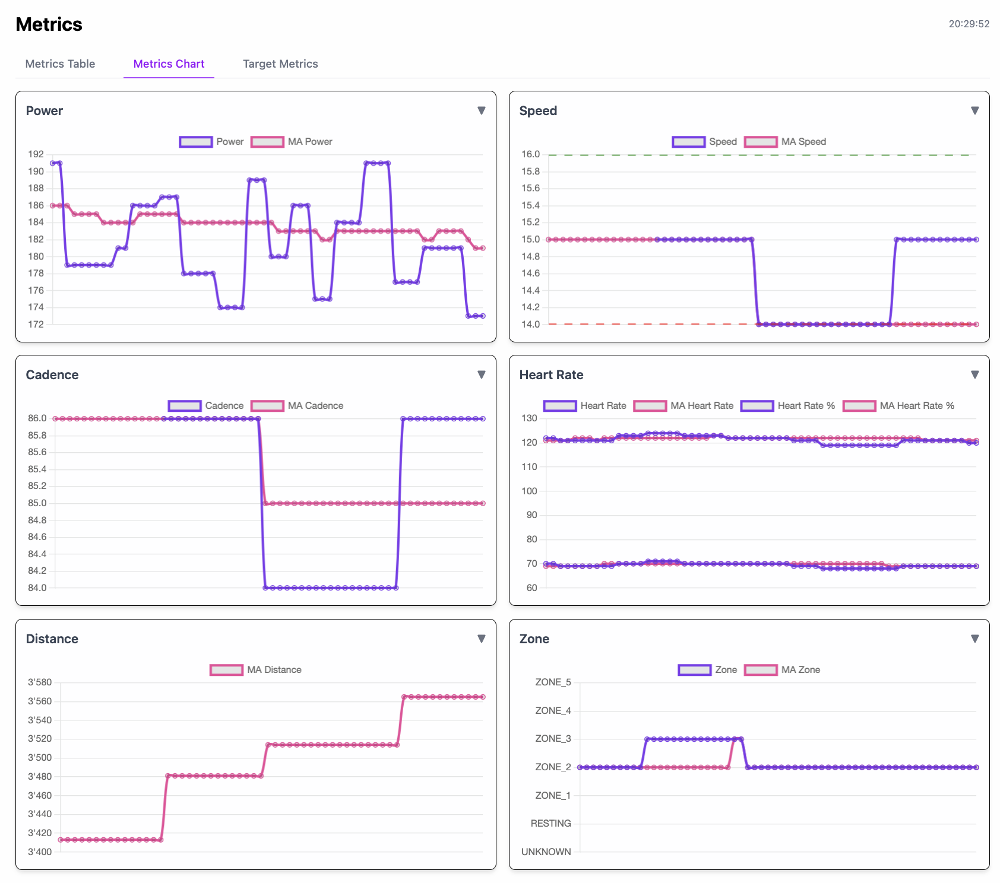
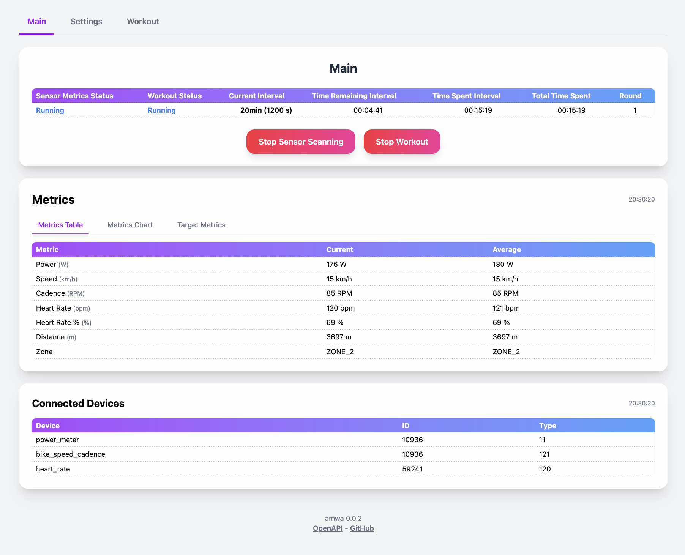

# ANT+ Metrics Web Application (AMWA)

**AMWA** is a **FastAPI** and **Vue.js** web application designed for real-time visualization of ANT+ sensor data on Raspberry Pi OS Lite or other Debian-based systems without a desktop environment.  

It enables monitoring of cycling and fitness metrics from ANT+ sensors through a lightweight web interface.






---

## Features

- Real-time display of ANT+ sensor data:
  - Power
  - Speed
  - Cadence
  - Heart Rate
  - Distance
- Built-in time display
- Configurable interval timer
- Web-based dashboard accessible via browser
- Optional Nginx configuration for frontend hosting
- Systemd service for automatic backend startup

**Display Metrcis as chart**


**Display Metrcis as table**


---

## Technology Stack

- **Backend:** FastAPI (Python)
- **Frontend:** Vue.js (Node.js)
- **ANT+ Communication:** [OpenANT](https://github.com/Tigge/openant)
- **Platform:** Raspberry Pi OS Lite (Debian-based, headless)

---

## Requirements

- ANT+ USB adapter (e.g., Tacx ANT+ Antenne)
- Python 3.12+ with:
  - `python3-venv`
  - `pip`
- Node.js
- npm 
- Git
- Optional: Nginx (for frontend deployment)
- Optional: `vim` for editing configurations

---

## Installation

1. Download script:

```bash
wget https://raw.githubusercontent.com/rueedlinger/amwa/refs/heads/main/scripts/install.sh -O install.sh
chmod +x install.sh
```

2. Run the installation script as **root** (sudo):

```bash
sudo ./install.sh
```

3. Follow the prompts to:
   - Update and install required software (optional)
   - Configure Python virtual environment
   - Build backend and frontend
   - Deploy frontend to `/var/www/html`
   - Configure Nginx (optional)
   - Set up ANT+ USB adapter (optional)
   - Install systemd service for automatic backend startup

**Logs** for the installation are saved at `~/amwa_install.log`.

---

## Usage

- Access the web interface in your browser at:

```bash
http://<raspberry-pi-ip>/
```

- Manage the backend service:

```bash
# Start service
sudo systemctl start amwa

# Stop service
sudo systemctl stop amwa

# Restart service
sudo systemctl restart amwa

# Check status
sudo systemctl status amwa
```

- ANT+ USB adapter may require re-plugging after adding your user to the `plugdev` group.

---


## Troubleshooting

- Ensure Node.js ≥16 and npm ≥8 are installed.
- If Nginx fails to reload, verify `/etc/nginx/sites-available/default` configuration.
- Check logs at `~/amwa_install.log` for detailed errors.
- Replug ANT+ USB adapters if sensor data is not detected.

---

## License

MIT License. Use at your own risk.

---

## Acknowledgements

- [FastAPI](https://fastapi.tiangolo.com/)
- [Vue.js](https://vuejs.org/)
- [OpenANT](https://github.com/Tigge/openant)

